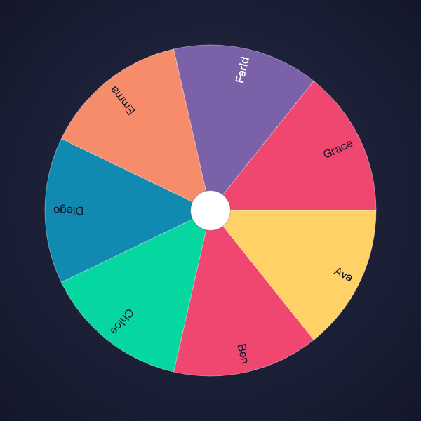

# Lucky Wheel

[](https://github.com/jerryxcy/lucky-wheel/actions/workflows/ci.yml)

A spin-wheel decision tool for teams. Build a roster, spin the wheel, and let
it pick who's on-call this week — or draw a full order for who goes first.
The whole thing runs from a single `java -jar`: no database, no build step, no
setup beyond a JDK.

<p align="center">
  
</p>

## Why it exists

Deciding "who's on-call" or "what order do we go in" is a small, recurring
source of friction. Names in a hat are unceremonious and easy to dispute; a
random-number site makes you re-type everyone every time. Lucky Wheel remembers
your team, makes the draw visibly fair, and turns it into a small moment of fun
in the stand-up.

## Quick start

Requires **Java 21**. From the repo root:

```bash
./mvnw package
java -jar target/lucky-wheel-0.0.1-SNAPSHOT.jar
```

Open <http://localhost:8080>. Colleagues on the same network can open it at your
machine's LAN address — handy for projecting the wheel in a meeting.

## Using it

- **Roster** — add members one at a time, or paste a whole list (newline- or
  comma-separated; duplicates are dropped). Copy the roster back out to move it
  between machines. The roster lives in your browser, so it's still there next
  week.
- **Eligible** — a checkbox per member decides who's in the next spin. Uncheck
  whoever was picked last week or is on leave today; one button re-checks
  everyone when a rotation completes.
- **Spin** — choose how many to pick (one, or a full-team order), then spin. The
  wheel reveals the result one pick at a time; **skip** jumps straight to the
  final order.
- **Auto-remove** — flip this on before spinning and picked members drop out of
  the next draw automatically, so a weekly rotation needs no bookkeeping.

## API

The server is a single stateless endpoint. The UI is just its first consumer —
you can drive it directly.

**`POST /api/spins`**

```jsonc
// request — members is the list to draw from; count is how many to pick
{ "members": ["Ava", "Ben", "Chloe"], "count": 2 }

// 200 — drawOrder is the picked members, in the order drawn
{ "drawOrder": ["Chloe", "Ava"] }
```

`count = 1` picks one member; `count = members.length` orders the whole list.

Bad input returns **400** with a human-readable message — an empty roster, a
`count` outside `1..members.length`, blank names, or duplicate names (after
trimming):

```bash
curl -s localhost:8080/api/spins \
  -H 'Content-Type: application/json' \
  -d '{"members":["Ava","Ava"],"count":1}'
# {"message":"Member names must be unique (after trimming whitespace)."}
```

## Design notes

- **Stateless server, roster in the browser.** There is no database and no
  server-side team model — the roster is kept in the browser's `localStorage`
  and sent in full with every spin. The endpoint's only job is turning a member
  list into a draw order. This keeps the server trivial and restart-safe, at the
  cost of rosters being per-browser. The trade-off and its rejected alternatives
  (H2 + JPA, in-memory `Map`) are recorded in
  [ADR-0001](docs/adr/0001-stateless-server-roster-in-browser.md).
- **The draw is a pure function.** Picking is `(members, count, RandomGenerator)
  → drawOrder` — a Fisher-Yates shuffle behind an injectable random source. That
  makes every property of a fair draw deterministically testable: exact count,
  no duplicates, a subset of the input, reproducibility under a fixed seed, a
  full permutation when `count` equals the roster size, and a large-sample
  uniformity check.
- **Two test seams.** The pure function is tested directly with a seeded random
  source; the HTTP contract (the 200 shape and every 400 case) is tested through
  `MockMvc`. Tests assert external behaviour only, so refactoring never breaks
  them.
- **Reveal is playback, not decision.** The API returns the whole draw order in
  one call; the wheel animation just replays that already-decided result, and
  skipping it changes nothing about the outcome.
- **No build step.** The UI is static HTML + vanilla JS served from the jar —
  no bundler, no `node_modules`. `java -jar` is the complete artifact.

## Tech

Java 21 · Spring Boot 3.5 (Web + Validation only — no JPA, H2, or Lombok) ·
vanilla JS + `<canvas>` · Maven wrapper · GitHub Actions CI.

## License

[MIT](LICENSE) © 2026 Jerry Wang
